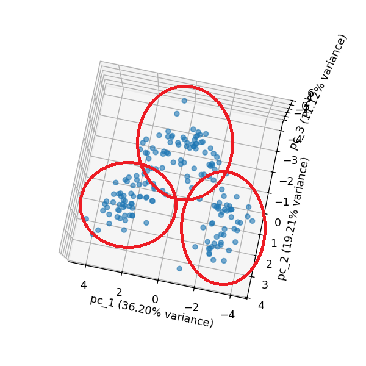

# k-means-clustering WIP
This project applies k-means clustering to segment data from a popular wine dataset that was originally introduced by Aberhard et al. in their 1994 study, <a href='https://www.semanticscholar.org/paper/Comparative-analysis-of-statistical-pattern-methods-Aeberhard-Coomans/83dc3e4030d7b9fbdbb4bde03ce12ab70ca10528'> *Comparative Analysis of Statistical Pattern Recognition Methods in High Dimensional Settings.*</a> Instead of using the k-means clustering algorithm that is built in to scikit-learn, I made my own k-means algorithm to practice translating theory into a real application.

So what do the data actually look like? The original wine dataset as referenced above includes some periphery data for unsupervised learning, so I found a similar version which removes that <a href='https://www.kaggle.com/datasets/harrywang/wine-dataset-for-clustering'>here</a>. There are 178 instances each with 13 features, expressing wine characteristics like alcohol level and color intensity. Most k-means classification that I've come across has been implemented in 2 dimensions for simplicity, so I decided to deviate slightly here and do 3 dimensions instead.

The first stage in k-means clustering is to first standardize all the data. A computer has no way of knowing how a 14.23 alcohol level relates to a 5.64 color intensity; a process must be used that can contextualize information irrespective of the units of measure. The scikit-learn StandardScalar function does exactly this -- it translates measurements with respect to a mean value of 0 and a standard deviation of 1, and in the case of multivariate data (which is the case for this wine dataset) it applies to all attribute columns. For the examples from earlier, a 14.23 alcohol level measurement translates to 1.52 standard deviations above the mean, and a 5.64 color intensity translates to 0.25 standard deviations above the mean. The formula used in the algorithm to get the standard score (z-score) is ```z = (x - u) / s```.

After scaling all data, a choice needs to be made about which method to employ to carry out dimensionality reduction. The dataset has 13 features (dimensions), which needs to be reduced to 3. This is necessary for a number of reasons, most important being that the actual utility of a k-means cluster analysis deminishes as you increase the number of dimensions, due to the appropriately phrased <a href='https://en.wikipedia.org/wiki/Curse_of_dimensionality'>*Curse of Dimensionality*</a>. There are several methods that can reduce the number of dimensions in this dataset, but the <a href='https://en.wikipedia.org/wiki/Principal_component_analysis'>Principal Component Analysis (PCA)</a> method is especially painless and also intuitive in this case. This technique involves choosing the top n vectors responsible for the highest proportion of dataset variance, therefore minimizing information loss while lowering dataset dimensions to a desired level. These curated data can be plotted in a 3d graph, which will reveal a point cloud.

<p align='center'>
  </img>
  </img>
</p>

After panning around in the interactive window, it is easy for a human to recognize that there are 3 clusters. But how do we guide a machine to the same understanding? Following k-means theory, we randomly generate 3 centroids to random (x,y,z) coordinates in the 3d graph, assign data points to each centroid by finding the nearest neighbor based on Euclidian distance, and then shifting the position of the centroid to the averaged location of all points assigned to it. This is done iteratively until the position of each centroid converges to the true center of a cluster in the point data. We know that we are finished iterating when either a predetermined number of iterations has been performed (I selected 100 as an upper limit just to be safe, but this is way overkill) or the amount of distance the centroid moves between iterations falls below a selected threshold (I chose 0.001 arbitrarily).


<p align='center'>
  </img>
</p>
